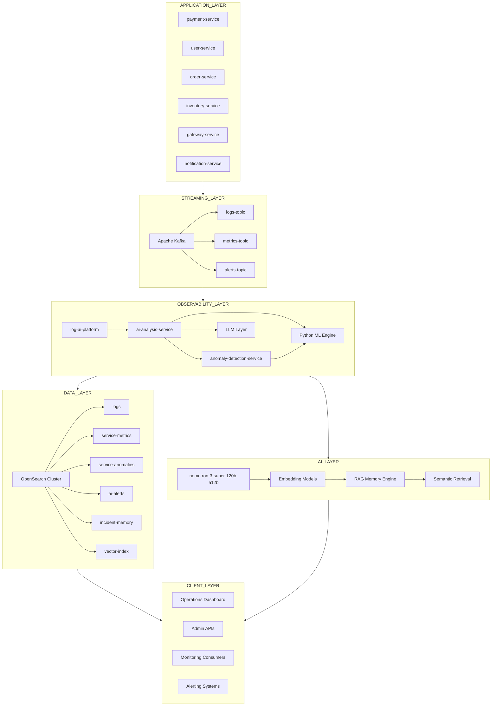
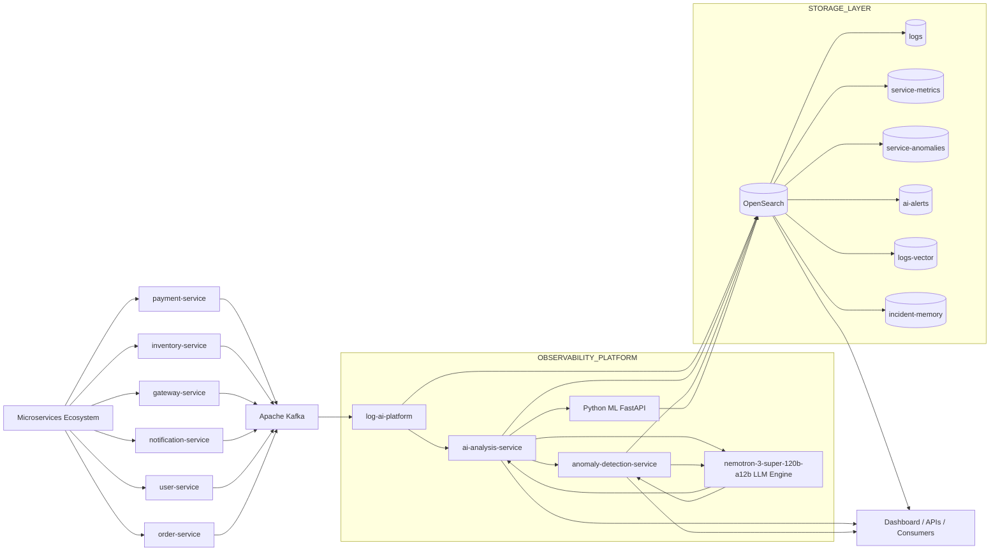
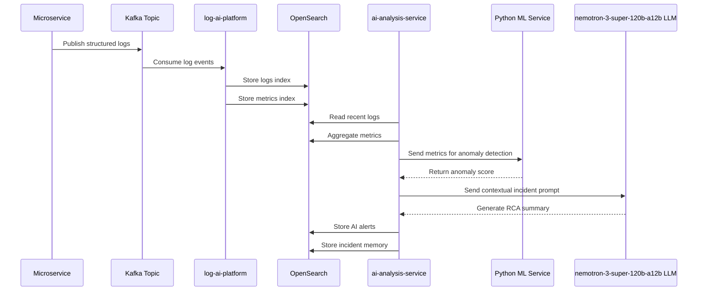
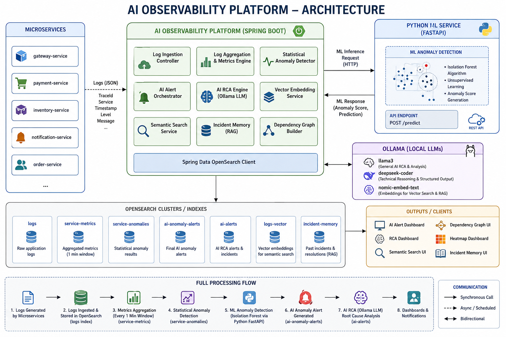

# AI-Powered Observability & Anomaly Detection Platform

## Overview

This project is a production-style AI-powered observability platform designed to centralize logs, detect anomalies, generate AI-driven root cause analysis (RCA), and provide semantic intelligence on top of distributed microservice ecosystems.

The platform combines:

* Real-time log ingestion
* OpenSearch indexing and querying
* Kafka-based streaming
* AI-assisted analysis
* Statistical + ML anomaly detection
* Semantic search
* Incident memory (RAG-ready)
* Dependency analysis
* Service health intelligence

The architecture demonstrates:

* Distributed systems design
* Event-driven architecture
* AI/ML integration with enterprise systems
* Observability engineering
* Scalable microservice orchestration
* Search and analytics architecture
* Production-grade indexing strategy
* Multi-service integration patterns

---

# Business Problem Solved

Modern distributed systems generate massive amounts of logs and operational data.

Traditional monitoring systems typically:

* Only detect infrastructure failures
* Cannot explain WHY failures happened
* Generate noisy alerts
* Miss hidden anomaly patterns
* Lack semantic intelligence
* Cannot correlate incidents across services

This platform solves those challenges by introducing:

| Problem                     | Solution                          |
| --------------------------- | --------------------------------- |
| Huge volume of logs         | Centralized OpenSearch indexing   |
| Alert fatigue               | ML-based anomaly scoring          |
| Slow RCA                    | AI-powered root cause analysis    |
| Unknown dependencies        | Dependency graph analysis         |
| Repeated incidents          | Incident memory + semantic search |
| Hidden operational trends   | Statistical + AI analytics        |
| Distributed trace confusion | Correlation-based analysis        |

---

# Scope of the Platform

The platform supports:

## Core Observability

* Centralized logging
* Service-wise log ingestion
* Structured log indexing
* Error aggregation
* Metrics generation
* Heatmaps and severity analytics

## AI & Intelligence Layer

* AI-generated root cause analysis
* Semantic search using embeddings
* Similar incident retrieval
* LLM-based operational insights
* AI alert summarization

## Anomaly Detection

* Statistical anomaly detection
* Isolation Forest ML model
* Service behavior analysis
* Latency spike detection
* Error burst detection

## Search & Analytics

* OpenSearch aggregation queries
* Full text search
* Vector search support
* Incident correlation
* Service dependency analysis

## Streaming & Event Processing

* Kafka-based asynchronous ingestion
* Decoupled processing architecture
* Real-time event-driven analysis

---

# High-Level Architecture



# Complete System Architecture

## Enterprise High-Level Architecture



---

# Low-Level Design Architecture

## Internal Processing Pipeline



---

# Technology Stack

## Backend Technologies

| Technology       | Purpose                     |
|------------------| --------------------------- |
| Java 17 / 21     | Backend services            |
| Spring Boot 3    | REST APIs & orchestration   |
| Spring WebFlux   | Reactive non-blocking APIs  |
| Spring Kafka     | Kafka integration           |
| FastAPI          | Python ML inference APIs    |
| OpenSearch       | Search and analytics engine |
| Nvidia           | Local LLM execution         |
| Isolation Forest | ML anomaly detection        |
| Maven            | Build management            |
| Docker           | Containerization            |
| Kafka            | Event streaming             |

---

---
# Schematic Diagram



# Repository Structure

```text
AI-PLATFORM-main/
│
├── log-ai-platform/
│   ├── Main observability platform
│   ├── Kafka ingestion
│   ├── OpenSearch indexing
│   ├── Metrics APIs
│   └── Core observability engine
│
├── ai-analysis-service/
│   ├── AI analysis layer
│   ├── RCA generation
│   ├── Semantic analysis
│   ├── Alert intelligence
│   └── AI orchestration
│
├── anomaly-detection-service/
│   ├── Statistical anomaly detection
│   ├── Aggregation analysis
│   └── OpenSearch analytics
│
└── ai-anomaly-service/
    ├── Python FastAPI ML service
    ├── Isolation Forest model
    ├── ML predictions
    └── Training APIs
```

---

# Services Explanation

# 1. log-ai-platform

## Responsibilities

* Kafka log ingestion
* OpenSearch indexing
* Metrics generation
* Centralized logging
* Service analytics
* Trace storage

## Tech Used

* Spring Boot 3.3.4
* Java 17
* Spring Kafka
* OpenSearch Java Client
* WebFlux

## Run the Service

```bash
cd log-ai-platform
```

## Build

```bash
mvn clean install
```

## Run

```bash
mvn spring-boot:run
```

OR

```bash
java -jar target/log-ai-platform-0.0.1-SNAPSHOT.jar
```

---

# 2. ai-analysis-service

## Responsibilities

* AI-based RCA
* AI summarization
* Semantic analysis
* Alert intelligence
* LLM orchestration
* AI correlation

## Tech Used

* Spring Boot 3.3.4
* Java 21
* WebFlux
* Kafka
* OpenSearch
* Nvidia nemotron-3-super-120b-a12b APIs

## Run the Service

```bash
cd ai-analysis-service
mvn clean install
mvn spring-boot:run
```

---

# 3. anomaly-detection-service

## Responsibilities

* Statistical anomaly detection
* Error spike analysis
* Trend analytics
* Aggregated metrics processing

## Tech Used

* Spring Boot 3.5.x
* Java 21
* OpenSearch Aggregations
* Jackson

## Run the Service

```bash
cd anomaly-detection-service
mvn clean install
mvn spring-boot:run
```

---

# 4. ai-anomaly-service

## Responsibilities

* ML-based anomaly detection
* Isolation Forest model
* Prediction APIs
* Training APIs

## Tech Used

* Python
* FastAPI
* Scikit-learn
* Pandas
* NumPy

## Install Dependencies

```bash
cd ai-anomaly-service
```

```bash
pip install -r requirements.txt
```

## Run the Service

```bash
uvicorn app:app --reload --port 8000
```

## Verify Health

```bash
GET http://localhost:8000/health
```

---

# OpenSearch Setup

# Run OpenSearch Using Docker

## Create Docker Network

```bash
docker network create ai-platform-network
```

## Start OpenSearch

```bash
docker run -d \
  --name opensearch \
  --network ai-platform-network \
  -p 9200:9200 \
  -p 9600:9600 \
  -e discovery.type=single-node \
  -e plugins.security.disabled=true \
  -e OPENSEARCH_INITIAL_ADMIN_PASSWORD=admin \
  opensearchproject/opensearch:latest
```

## Verify OpenSearch

```bash
curl http://localhost:9200
```

Expected response:

```json
{
  "name" : "opensearch",
  "cluster_name" : "docker-cluster"
}
```

---

# OpenSearch Index Strategy

## Core Indexes

| Index Name        | Purpose              |
| ----------------- | -------------------- |
| logs              | Raw centralized logs |
| service-metrics   | Aggregated metrics   |
| service-anomalies | Anomaly results      |
| ai-alerts         | AI-generated alerts  |
| ai-anomaly-alerts | ML anomaly alerts    |
| logs-vector       | Embedding vectors    |
| incident-memory   | Historical incidents |

---

# Create OpenSearch Indexes

## logs Index

```bash
PUT logs
{
  "mappings": {
    "properties": {
      "serviceName": { "type": "keyword" },
      "level": { "type": "keyword" },
      "message": { "type": "text" },
      "traceId": { "type": "keyword" },
      "timestamp": { "type": "date" }
    }
  }
}
```

---

## service-metrics Index

```bash
PUT service-metrics
{
  "mappings": {
    "properties": {
      "serviceName": { "type": "keyword" },
      "errorCount": { "type": "integer" },
      "warnCount": { "type": "integer" },
      "criticalCount": { "type": "integer" },
      "avgResponseTime": { "type": "float" },
      "timestamp": { "type": "date" }
    }
  }
}
```

---

## service-anomalies Index

```bash
PUT service-anomalies
{
  "mappings": {
    "properties": {
      "serviceName": { "type": "keyword" },
      "anomalyScore": { "type": "float" },
      "isAnomaly": { "type": "boolean" },
      "reason": { "type": "text" },
      "timestamp": { "type": "date" }
    }
  }
}
```

---

# Starting the Python ML Server

The `ai-anomaly-service` is a FastAPI-based machine learning service responsible for:

- ML anomaly detection
- Isolation Forest predictions
- Model training
- AI metric scoring

---

# Prerequisites

Make sure the following are installed:

| Software | Recommended Version |
|---|---|
| Python | 3.11+ |
| pip | Latest |
| virtualenv | Latest |

Verify installation:

```bash
python --version
pip --version
```

---

# Navigate to the Python Service

```bash
cd ai-anomaly-service
```

---

# Create Virtual Environment

## Windows

```bash
python -m venv venv
```

Activate:

```bash
venv\\Scripts\\activate
```

---

## Linux / Mac

```bash
python3 -m venv venv
```

Activate:

```bash
source venv/bin/activate
```

---

# Install Dependencies

```bash
pip install -r requirements.txt
```

Typical dependencies include:

- fastapi
- uvicorn
- scikit-learn
- pandas
- numpy
- joblib

---

# Start the FastAPI Server

```bash
uvicorn app:app --host 0.0.0.0 --port 8000 --reload
```

Explanation:

| Parameter | Meaning |
|---|---|
| app | Python file name (`app.py`) |
| app | FastAPI object inside file |
| --reload | Auto reload on code changes |
| --port 8000 | Runs on port 8000 |

---

# Verify Server

Open browser:

```text
http://localhost:8000/docs
```

FastAPI Swagger UI should appear.

---

# Health Check API

```http
GET /health
```

Example:

```bash
curl http://localhost:8000/health
```

Expected Response:

```json
{
  "status": "UP"
}
```

---

# Train ML Model

```http
POST /train
```

Sample Payload:

```json
[
  {
    "error_count": 10,
    "warn_count": 5,
    "critical_count": 1,
    "avg_response_time": 120.5,
    "unique_exception_count": 2
  }
]
```

---

# Predict Anomaly

```http
POST /predict
```

Sample Payload:

```json
{
  "error_count": 50,
  "warn_count": 10,
  "critical_count": 5,
  "avg_response_time": 2000,
  "unique_exception_count": 15
}
```

Expected Response:

```json
{
  "is_anomaly": true,
  "score": -0.84
}
```

---

# Common Errors

## Module Not Found

Install missing dependencies:

```bash
pip install -r requirements.txt
```

---

## Port Already In Use

Run on different port:

```bash
uvicorn app:app --port 8001 --reload
```

---

## Uvicorn Not Found

Install manually:

```bash
pip install uvicorn
```

---

# Production Deployment

Recommended production server:

```bash
uvicorn app:app --host 0.0.0.0 --port 8000
```

OR using Gunicorn:

```bash
gunicorn -w 4 -k uvicorn.workers.UvicornWorker app:app
```

---

# Docker Run Example

```bash
docker build -t ai-anomaly-service .
```

```bash
docker run -p 8000:8000 ai-anomaly-service
```

---

# Architecture Role

The Python ML service acts as the machine learning inference engine for the platform.

Responsibilities include:

- Statistical anomaly scoring
- Isolation Forest prediction
- ML feature evaluation
- AI-assisted operational analytics
- Real-time anomaly classification

# Kafka Setup

# Run Kafka Using Docker Compose

Create:

```yaml
version: '3'

services:
  zookeeper:
    image: confluentinc/cp-zookeeper:latest
    environment:
      ZOOKEEPER_CLIENT_PORT: 2181
    ports:
      - "2181:2181"

  kafka:
    image: confluentinc/cp-kafka:latest
    ports:
      - "9092:9092"
    environment:
      KAFKA_BROKER_ID: 1
      KAFKA_ZOOKEEPER_CONNECT: zookeeper:2181
      KAFKA_ADVERTISED_LISTENERS: PLAINTEXT://localhost:9092
      KAFKA_OFFSETS_TOPIC_REPLICATION_FACTOR: 1
    depends_on:
      - zookeeper
```

## Start Kafka

```bash
docker-compose up -d
```

---

# Create Kafka Topics

## Create Log Topic

```bash
docker exec -it kafka kafka-topics \
--create \
--topic logs-topic \
--bootstrap-server localhost:9092 \
--partitions 3 \
--replication-factor 1
```

## Create Metrics Topic

```bash
docker exec -it kafka kafka-topics \
--create \
--topic metrics-topic \
--bootstrap-server localhost:9092 \
--partitions 3 \
--replication-factor 1
```

## Verify Topics

```bash
docker exec -it kafka kafka-topics \
--list \
--bootstrap-server localhost:9092
```

---
```

---

# OpenRouter Configuration

If you are using OpenRouter for LLM access, configure the model correctly in your application properties.

## application.properties

```properties
openrouter.api.model=nvidia/nemotron-3-super-120b-a12b:free
```

## application.yml

```yaml
openrouter:
  api:
    model: nvidia/nemotron-3-super-120b-a12b:free
```

---

# Running the Entire Platform

## Recommended Startup Order

1. OpenSearch
2. Kafka
3. Nvidia nemotron-3-super-120b-a12b
4. Python ML Service
5. log-ai-platform
6. ai-analysis-service
7. anomaly-detection-service

---

# Example End-to-End Flow

```text
Microservice Logs
        ↓
Kafka Topic
        ↓
log-ai-platform
        ↓
OpenSearch
        ↓
ai-analysis-service
        ↓
Python ML Service
        ↓
nemotron-3-super-120b-a12b LLM
        ↓
AI Alerts + RCA + Anomaly Detection
```

---

# AI Features

## AI Root Cause Analysis

The AI engine:

* Reads recent logs
* Correlates exceptions
* Identifies dependency failures
* Summarizes probable root cause
* Generates operational explanations

---

## Semantic Search

The platform supports semantic retrieval using embeddings.

Example:

```text
"Find incidents similar to Redis timeout failures"
```

The vector search engine retrieves semantically related incidents instead of keyword-only matches.

---

## Incident Memory (RAG)

The platform stores:

* Historical incidents
* RCA summaries
* Alert explanations
* Operational patterns

This enables:

* Similar incident recommendations
* Historical RCA reuse
* Faster production debugging

---

# Scalability Considerations

## Designed for Horizontal Scaling

| Component            | Scaling Strategy             |
|----------------------| ---------------------------- |
| Kafka                | Partition scaling            |
| OpenSearch           | Shard scaling                |
| Spring Boot Services | Kubernetes replicas          |
| Python ML            | Stateless scaling            |
| Nvidia               | GPU-backed inference scaling |

---

# Production Enhancements (Future Scope)

## Future Improvements

* Kubernetes deployment
* Grafana dashboards
* Prometheus integration
* OpenTelemetry tracing
* Distributed tracing visualization
* Real-time alerting
* Slack integration
* Jira auto-ticketing
* AI copilot for operations
* Auto-remediation workflows
* Multi-tenant observability
* GPU inference acceleration

---

# Sample Operational Use Cases

## Example 1: Redis Failure Spike

The system:

* Detects Redis timeout spike
* Correlates multiple services
* Generates anomaly alert
* Produces AI RCA summary
* Stores incident memory

---

## Example 2: Latency Degradation

The system:

* Detects abnormal response time increase
* Identifies affected services
* Generates dependency graph impact
* Produces AI recommendations

---

# Engineering Highlights

This project demonstrates:

* Event-driven architecture
* Distributed systems thinking
* Enterprise observability design
* AI + backend integration
* Search infrastructure design
* ML inference integration
* Scalable analytics architecture
* Production-ready indexing strategy
* Service orchestration patterns
* Real-time streaming systems

---

# Recommended Environment

| Component  | Version |
|------------| ------- |
| Java       | 17 / 21 |
| Python     | 3.11+   |
| Maven      | 3.9+    |
| Docker     | Latest  |
| OpenSearch | 2.x     |
| Kafka      | Latest  |
| Nvidia     | Latest  |

---

# API Examples

## Train ML Model

```http
POST /train
```

Payload:

```json
[
  {
    "error_count": 10,
    "warn_count": 5,
    "critical_count": 1,
    "avg_response_time": 120.5,
    "unique_exception_count": 2
  }
]
```

---

## Predict Anomaly

```http
POST /predict
```

Payload:

```json
{
  "error_count": 50,
  "warn_count": 10,
  "critical_count": 5,
  "avg_response_time": 2000,
  "unique_exception_count": 15
}
```

---

# Final Summary

This project is a complete AI-powered observability ecosystem that combines:

* Distributed systems
* AI engineering
* Search infrastructure
* ML anomaly detection
* Event streaming
* Semantic intelligence
* Operational analytics


It is designed to showcase strong backend engineering, platform engineering, observability architecture, AI integration, and scalable enterprise system design skills.
